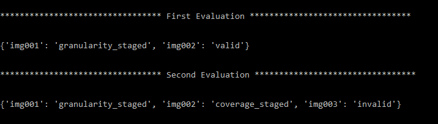

# Coding Assignment

A simple method to make more open class flexibility for detection problems.

# Requirements

* Python3

* Json

* Argparse

# Setup 

`git clone https://github.com/Kamilbentounes/coding-assignment.git` 

`cd coding-assignment`

# Usage

Very easy to use. Put in `data\` all your Json files (build, edits, extract and expected (if necessary)). Then, run the following: 

`python database.py` 

# Arguments

This is how to put your own Json files paths in aguments:

`python database.py --buildFile path/to/build_graph.json --editsFile path/to/edits_graph.json --extractFile path/to/img_extract.json --expectedStatus path/to/expected_status.json`

* `--buildFile` refers to the path where you have put graph_build.json.  

* `--editsFile` refers to the path where you have put graph_edits.json.

* `--extractFile` refers to the path where you have put img_extract.json.

* `--expectedStatus` refers to the path where you have put expected_status.json.

# Notes 

You can modify/generate a new graph with the function `add_nodes()`. In the case of generating a new one, you have to put the new root node with `None` parent in the first element of the argument list past in argument of `add_nodes()`. If the last root is the same of the new one, the new nodes are added directly. If they are different, the past graph is replaced by a new one with the new root node. If any root node's parent is not in the first element, an error will be generated. This to avoid doing two loops. 

A lot of data structures can be used in this project. I chose `dict()` for the sake of simplicity. List of tuples, graphs or objects could also be used.

# Testing 

### Fisrt Evaluation

Here a self-evaluation with the following example:

Here the output of comparaison of my expexted status with all data test expected status:

